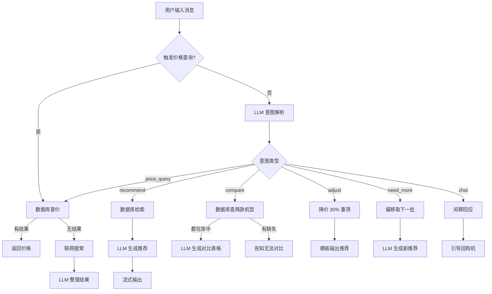
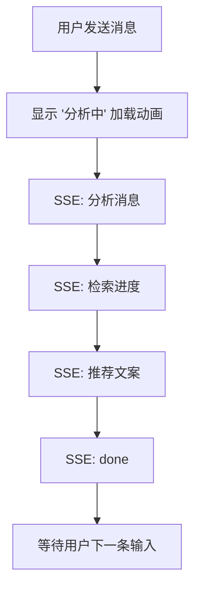

# 【V1.0】智能购机助手\_PRD\_V1.0

**版本**：V1.0 | **状态**：草稿 | **类型**：功能型

***

## 0. PRD 类型判定

| 判定项         | 内容                                |
| ----------- | --------------------------------- |
| **PRD 类型**  | 功能型（新功能上线）                        |
| **判定依据**    | 从零到一构建一个基于大模型的对话式手机选购助手，不存在现成功能   |
| **必须包含的结构** | §1 收益预估、§2 业务流程、§5 详细功能说明、§8 验收标准 |

***

## 1. 项目背景与收益预估

### 需求简介

构建一个基于大语言模型的对话式手机选购助手，用户通过自然语言描述购机需求（如"3000 元拍照手机"），系统理解意图后从数据库中检索匹配机型，生成个性化推荐文案，并通过流式输出逐字呈现。同时支持价格查询、机型对比、预算调整追问等辅助功能。

### 业务诉求

- 手机品牌和型号繁多，普通消费者缺乏参数解读能力，难以在预算和需求之间做决策
- 现有电商平台的筛选器交互门槛高（需要用户理解内存、芯片、摄像头等专业参数）
- 购机决策链条长，用户需要在多个机型间反复对比

### 收益预估

| 收益层级     | 内容                                              |
| -------- | ----------------------------------------------- |
| **用户收益** | 将购机决策时间从平均 2-3 天缩短至 10 分钟内完成"需求描述→推荐→对比→决策"全流程  |
| **业务收益** | 用户对话留存率 ≥ 60%（单次对话超过 3 轮的用户占比），验证 AI 导购模式的用户接受度 |
| **商业收益** | 为后续接入电商下单链路打下基础，探索"对话式购物"的产品形态                  |
| **不做风险** | 购机决策门槛不变，用户持续流向已有参数筛选能力的竞品平台                    |

***

## 2. 业务流程简述

```
用户输入购机需求 → 系统流式输出分析过程 → 数据库检索匹配机型 → LLM 生成推荐文案 → 流式输出推荐结果 → 
  ├─ 用户满意 → 结束 / 继续提问（对比/价格）
  ├─ 用户说"太贵了" → 自动降低预算重新检索 → 推荐更低价机型
  ├─ 用户问"还有吗" → 偏移推荐偏移量 → 推送下一批机型
  └─ 用户问"XX 多少钱" → 数据库查询价格 → 有则秒出 / 无则联网搜索
```

***

## 3. 版本管理

### 3.1 PRD 文档自身修订记录

| 版本号  | 日期         | 修订人 | 修订内容          |
| ---- | ---------- | --- | ------------- |
| V1.0 | 2026-06-10 | Ruu | 初稿，覆盖购机助手全部功能 |

### 3.2 产品版本信息

| 项目       | 内容                       |
| -------- | ------------------------ |
| 所属项目     | 智能购机助手                   |
| PRD 评审版本 | V1.0                     |
| 目标上线版本   | V1.0                     |
| 本期范围     | 对话推荐、价格查询、预算调整、机型对比、闲聊应答 |
| 后续范围     | 电商下单链路接入、用户收藏夹、历史对话归档    |

***

## 4. 系统关联与依赖

### 依赖模块列表

| 模块                       | 依赖关系                     | 接口契约                  |
| ------------------------ | ------------------------ | --------------------- |
| 大语言模型 API（DeepSeek Chat） | 意图识别、推荐文案生成、对比分析、闲聊应答均依赖 | OpenAI 兼容接口，流式 SSE 返回 |
| SQLite 数据库               | 手机数据存储与检索                | 本地文件数据库，无网络依赖         |
| DuckDuckGo 搜索            | 兜底价格查询（数据库未命中时）          | HTTP Get，返回网页摘要       |

### 数据流说明

```
用户输入 → FastAPI 路由层 → LLM 意图解析（JSON 结构化输出） → 
  ├─ recommend → 数据库检索 → LLM 推荐文案生成 → SSE 流式返回
  ├─ compare → 数据库查询两款机型 → LLM 对比分析 → SSE 流式返回
  ├─ price_query → 数据库查价 → 有则直接返回 / 无则联网搜索 → 返回
  ├─ adjust → 更新 session 预算 → 数据库重筛 → 模板生成返回
  └─ chat → 直接 LLM 闲聊 → SSE 流式返回
```

### 接口定义

| 接口           | 入参                                       | 出参                                   | 说明     |
| ------------ | ---------------------------------------- | ------------------------------------ | ------ |
| `POST /chat` | `{message: string, session_id?: string}` | SSE 流（event: message / done / error） | 核心对话接口 |

### 降级策略

- LLM 生成推荐文案失败：回退到模板输出（机型名 + 价格 + 简介），不展示空白
- 数据库查询为空：告知用户"当前数据库中暂无匹配机型"，并引导调整预算或需求

***

## 5. 详细功能说明

### 5.1 对话推荐功能

#### 位置

- 前端页面：单页应用，居中对话区域
- 入口：页面加载即显示欢迎语，用户直接在底部输入框输入

#### 目标

用户用自然语言描述购机需求，系统理解后推荐 2-3 款最匹配的机型，并提供个性化推荐理由。

#### 功能描述

**输入阶段：**

- 用户输入框：支持中英文、数字、标点
- 发送按钮：输入为空时置灰不可点击；输入非空时高亮可点击
- 发送方式：点击发送按钮或按回车键均触发发送
- 发送后：输入框自动清空，按钮回到置灰状态

**处理阶段（流式输出）：**

- 用户发送后，立即在对话区域显示用户消息气泡（右对齐，灰色背景）
- 紧接着显示助手气泡（左对齐，白色背景），气泡内首先显示"分析中"加载动画
- 系统分三步流式推送：
  1. 分析消息（如"正在分析你的需求..."）
  2. 数据库检索进度（如"已找到 3 款符合条件的机型..."）
  3. 最终推荐文案（机型名称、价格、推荐理由）
- 每一步以 SSE event 推送到前端，前端直接追加文本到助手气泡中

**推荐规则：**

- 默认每次推荐 3 款机型
- 排序方式：数据库按价格 + 评分综合排序
- 推荐结果包含：机型名称、参考价格、一句话推荐理由
- 价格匹配规则：精确价格匹配 ±500 元范围内机型

**异常处理：**

- 数据库无匹配机型：告知"当前没有匹配需求的机型"，引导调整预算或用途
- LLM 生成文案失败：使用模板生成基础推荐文案（机型 + 价格 + 基础介绍），不展示空白

***

### 5.2 价格快捷查询

#### 位置

对话界面内，用户直接输入"XX 多少钱"触发

#### 目标

用户快速查询某款机型的当前参考价格，秒级响应，不调用 LLM（节省成本）。

#### 功能描述

**触发规则：**

- 用户消息匹配正则：`(.+?)多少钱$` 或 `(.+?)价格$`
- 匹配后跳过 LLM 意图解析，直接进入价格查询流程

**查询流程：**

1. 从数据库中按机型名称模糊匹配（支持中文品牌名和英文型号名）
2. 匹配成功 → 秒级返回 `{机型名} 当前参考价：¥{价格}（{一句话简介}）`
3. 匹配失败 → 调用 DuckDuckGo 搜索 "{机型名} 手机价格"
4. 搜索结果中提取到价格信息 → LLM 整理后返回
5. 搜索也未查到 → 返回"暂未查到「{机型名}」的价格，建议稍后再查或关注官方渠道"

**加载状态：**

- 数据库查询阶段：直接显示"正在查询..."（极短，≤500ms，可省略）
- 联网搜索阶段：显示"正在为你查找价格..."
- 搜索完成：显示结果

**边界规则：**

- 价格显示单位：人民币（¥），整数显示，不保留小数

***

### 5.3 预算调整功能

#### 位置

对话界面内，用户对推荐结果不满意时表达"太贵了"、"预算不够"等意图触发

#### 目标

用户觉得推荐机型偏贵时，系统自动降低预算重新推荐，无需用户手动输入新预算数字。

#### 功能描述

**触发规则：**

- LLM 意图解析返回 `type: "adjust"` 即触发
- 不依赖 LLM 返回的价格字段（避免 LLM 解析不准）
- 当前对话 session 中必须有上一次推荐时使用的 `max_price`

**调整逻辑：**

1. 取当前 session 的 `max_price`
2. 降价 30%（新预算 = `max_price * 0.7`）
3. 以新预算为上限重新检索数据库
4. 跳过 LLM 生成环节（节省成本），使用模板直接输出推荐

**输出模板：**

```
好的，帮你找了一些价格更实惠的机型：

1. {机型名} —— ¥{价格}
{一句话简介}

2. {机型名} —— ¥{价格}
{一句话简介}

3. {机型名} —— ¥{价格}
{一句话简介}
```

**异常处理：**

- 降价后无匹配机型：告知"这个价位暂时没有合适的机型"，引导用户给出具体预算数字
- session 中无 `max_price`：告知"请告诉我你的预算范围，我帮你重新推荐"

***

### 5.4 追问更多功能

#### 位置

对话界面内，用户说"还有吗"、"其他的呢"、"再来几款"触发

#### 目标

用户看完首批推荐后想查看更多选项，系统推送下一批机型。

#### 功能描述

**触发规则：**

- LLM 意图解析返回 `type: "need_more"` 即触发
- 依赖 session 中的 `recommended_ids`（上一次推荐的全量排序 ID 列表）和 `recommendation_offset`（当前偏移量）

**输出逻辑：**

1. 从 `recommended_ids` 中跳过前 `offset` 个，取后续 2-3 款机型
2. 更新 session 中的 `offset`（累加本次推送数量）
3. 调用 LLM 重新生成推荐文案（确保推荐理由不重复）

**边界规则：**

- 当 `offset ≥ recommended_ids.length`（已无可推荐机型）：告知"目前符合条件的就是这些了，你可以换个需求试试"
- session 中无 `recommended_ids`（未经过推荐阶段）：告知"你可以先描述一下购机需求，我帮你推荐几款"

***

### 5.5 机型对比功能

#### 位置

对话界面内，用户输入"X 和 Y 哪个好"、"对比 X 和 Y"触发

#### 目标

用户在两款机型之间犹豫时，系统给出并排参数对比表格。

#### 功能描述

**触发规则：**

- 正则匹配：`(.+?)(?:和|与|vs|VS)(.+?)哪个好` 或 `对比(.+?)和(.+?)`
- 匹配后进入对比流程

**对比流程：**

1. 从消息中提取两个机型名称（支持中英文，如"小米14"、"iPhone16"、"vivo X100"）
2. 数据库中按机型名称检索，找到对应的两款机型
3. LLM 生成对比分析文案 + 参数对比表格

**对比表格格式：**

| 参数   | {机型 A}     | {机型 B}     |
| ---- | ---------- | ---------- |
| 参考价格 | ¥{价格}      | ¥{价格}      |
| 处理器  | {处理器}      | {处理器}      |
| 内存   | {RAM}/{存储} | {RAM}/{存储} |
| 电池容量 | {电池}       | {电池}       |
| 拍照评分 | {评分}       | {评分}       |
| 推荐理由 | {一句话}      | {一句话}      |

**异常处理：**

- 数据库中查不到其中一款或两款：告知"抱歉，{机型名}暂未收录在数据库中，暂时无法对比"
- 提取的机型名在数据库中匹配到多个结果（如"小米14"匹配到 Xiaomi 14 和 Xiaomi 14 Pro）：取名称最短的（默认为基础版）
- 用户只提了一款机型（"小米14哪个好"）：告知"请指定两款机型进行对比"

***

### 5.6 闲聊与引导功能

#### 位置

对话界面内，用户输入非购机相关的内容时触发

#### 目标

礼貌回应用户的问候/道别/闲聊，并将其引导回购机主流程。

#### 触发规则

LLM 意图解析返回 `type: "chat"` 时触发。

#### 功能描述

| 用户输入      | 系统回应                                    |
| --------- | --------------------------------------- |
| "你好"、"hi" | "你好，我是智能购机助手！想买手机的话，告诉我你的预算和用途，我来帮你推荐～" |
| "谢谢"、"感谢" | "不客气，有需要随时找我～"                          |
| "拜拜"、"再见" | "再见，祝你选到心仪的手机！"                         |
| 其他闲聊      | 礼貌回应后引导："有什么购机需求可以随时问我～"                |

#### 边界规则

- 每次闲聊后均引导回选购流程

***

## 6. 流程与状态图表

### 6.1 购机助手主流程



### 6.2 流式输出状态机



***

## 7. 验收标准

| #  | 场景      | 前置条件                       | 操作                    | 期望结果             | 判定              |
| -- | ------- | -------------------------- | --------------------- | ---------------- | --------------- |
| 1  | 正常推荐    | 数据库有 3000-4000 元机型         | 输入"3000 打游戏"          | 推荐 3 款机型，带价格+理由  | 输出 3 款且价格在范围内   |
| 2  | 未给预算    | 用户没说价格                     | 输入"推荐手机"              | 反问"预算多少"         | 收到反问且不推荐机型      |
| 3  | 价格查询命中  | 数据库有 Xiaomi 14             | 输入"小米14多少钱"           | 秒出 ¥3999         | 无流式延迟，直接显示      |
| 4  | 价格查询未命中 | 数据库无该机型                    | 输入"三星S25多少钱"          | 联网搜索或告知未查到       | 显示搜索进度，不卡死      |
| 5  | 预算调整    | session 中有 max\_price=5000 | 先推荐后输入"太贵了"           | 降价 30% 推荐        | 新推荐价格 ≤ 3500    |
| 6  | 追问更多    | 已推荐过一批                     | 输入"还有吗"               | 推送不同机型           | 与首批推荐不重复        |
| 7  | 机型对比    | 两款均在库中                     | 输入"小米14和vivo X100哪个好" | 对比表格             | 含价格/处理器/电池/拍照四列 |
| 8  | 机型缺失对比  | 其中一款不在库中                   | 输入"小米14和iPhone16哪个好"  | 告知 iPhone16 不在库中 | 不编造参数           |
| 9  | 闲聊      | 无                          | 输入"你好"                | 礼貌回应并引导回选购       | 不调数据库           |
| 10 | 空输入     | 输入框为空                      | 点击发送                  | 不发送，按钮置灰         | 无网络请求           |

***

## 8. 辅助材料清单

| 审查项   | 材料                      | 说明                     |
| ----- | ----------------------- | ---------------------- |
| UI 截图 | 项目运行中截图（对话界面、推荐卡片、对比表格） | 可直接从 localhost:5174 截取 |
| 流程图   | 见 §6 Mermaid 图表         | 内嵌于 PRD，无需额外文件         |

***

